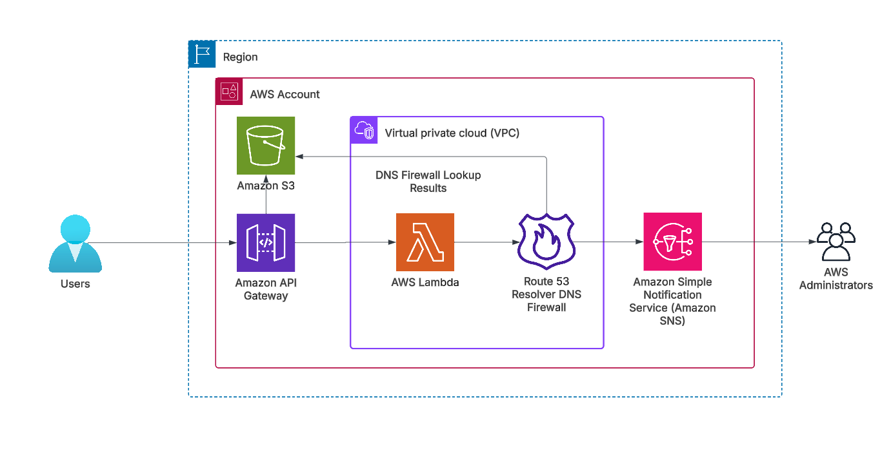

## Route 53 DNS Firewall Domain Detection System

A solution for detecting and blocking malicious domains using Amazon Route 53 Resolver DNS Firewall, leveraging both AWS Managed Domain Lists and custom blocklists.

## Overview

This system provides automated detection and blocking of malicious domains by:

* Utilizing AWS Managed Domain Lists that are automatically updated with new threats
* Supporting custom domain blocklists
* Providing real-time domain validation whether a domain is categorized by Amazon Route53 Resolver DNS Firewall as suspicious or not 
* Sending automated notifications for detected threats

## Architecture



Users looking to validate whether specific domains are suspicious, can upload a list of domains to an S3 bucket in the form of a CSV file and then trigger an API Gateway endpoint. This endpoint invokes a Lambda function within a VPC that performs DNS lookups on the domains, applying Route 53 Resolver DNS Firewall predefined security rules (managed / custom) to block and flag queries to suspicious domains. The validation results are stored in an S3 bucket, and Amazon SNS promptly notifies administrators about flagged domains.This workflow leverages AWS services to create a robust system for validating suspicious domains, combining security features like DNS Firewall with serverless computing and notification services.

**AWS Services:**

* **Amazon Route 53 Resolver DNS Firewall**: AWS Managed Domain lists and custom domain lists for domain lookup and customized DNS query responses, blocking or allowing a domain
* **Amazon API Gateway**: to create and publish an APIs required for this solution
* **Amazon S3**: Stores the input CSV files and validation results
* **AWS Lambda**: running within the VPC to perform domain resolution and to get appropriate responses from DNS Firewall based on the rules configured
* **Amazon Simple Notification Service (Amazon SNS)**: used to send email notifications to the administrators 

## Prerequisites

* AWS Account
* Familiarity with AWS CloudFormation

**Libraries Required**

dnslib (specifically dnspython) is needed in this solution for the Lambda function to perform DNS query resolution operations on the domains listed in the input CSV files.

* Create dnslib.zip from latest dnspython stable version (2.7.0 stable version at the time of publishing)

```
mkdir python
pip install dnspython==2.7.0 -t python
zip -r dnslib.zip python
```
* Create an Amazon S3 bucket in your desired AWS Region
* Upload the dnslib.zip file to the bucket

**Deploy CloudFormation Stack**

* Launch the CloudFormation stack using the provided template `dnsfirewall.yaml`
* Configure the following parameters:
        **Stack name**
        **DNSFirewallManagedDomainListId:**
            *   Navigate to Amazon Virtual Private Cloud (Amazon VPC) service and click on VPC dashboard 
            *   In the left navigation pane, under DNS Firewall choose Domain lists.
            *   Look for the domain list named “AWSManagedDomainsAggregateThreatList” 
            *   The ID of the AWSManagedDomainsAggregateThreatList is displayed in the ID column next to its name. It typically starts with “rslvr-fdl-” followed by a unique identifier.
        
        **SNSEmailAddress:** Email address of the administrator to receive emails
        **DNSLIBS3Bucket:** S3 bucket where you uploaded the dnslib.zip file

## Using AWS Managed Domain List

**Step 1:** Upload a CSV file with the name domains.csv containing a list of domains to be validated as malicious or not, to an S3 bucket aws-checkdomains-<AWS_Account_Number> set up by the CloudFormation stack. In the screenshot below, we show sample domains to be validated.


Note: The name of the file must be domains.csv. If any other file name is provided, then the domains list isn’t picked up. If you want to change the file name, then you can modify the Lambda code in the function `DNSDomainResolutionLambda`

**Step 2:** Obtain the DNS Lookup REST API from CloudFormation Stack Output published by API Gateway, to
perform the DNS domain lookup and trigger the API, as shown in Figure 4. Obtain the API Key from the API
Gateway console. You can use the ‘x-api-key’ in the header and enter the value as the API Key obtained from the API Gateway console. You can use tools such as postman, curl, your own code, etc. to trigger the API.


**Step 3:** Responses are saved in the same S3 bucket as dnsanswers.csv. You should see the status code as 200 returned by the Amazon Route 53 DNS Firewall for successfully resolved domains and a status code in 500s for malicious domains tagged by the DNS Firewall Managed Domain List (In screenshot below, we show 501: domains blocked by managed list/custom list. 502: errors such as domain does not exist and others).


**Step 4:** Simultaneously, the Administrator receives an instant alert about three domains reporting 501 status code as shown in the Figure 6. For the complete list, refer to the dnsanswers.csv file in the aws-checkdomains-<AWS_Account_Number> S3 bucket. 
 
 

## Using Custom Domain List

* Create custom_domains_list.csv with your custom domains
* Upload to aws-customdomains-<AWS_Account_Number> S3 bucket
* System will automatically create/update DNS Firewall rules
* Use the DNS Lookup REST API (available in CloudFormation Stack Output) to trigger domain validation
* Check results in `dnsanswers.csv` and email notifications

**Step 1:** Prepare a csv file with the name custom_domains_list.csv containing a list of your custom domains as shown below:


If any other file name is provided, then the domains list isn’t picked up. If you want to change the file name, then you can modify the Lambda code in the function “CustomDNSDomainListLambda”. Ensure that there are no duplicate domains in the custom_domains_list.csv file. Otherwise the Lambda function fails with the following error:

```
[ERROR] ValidationException: An error occurred (ValidationException) when calling the UpdateFirewallDomains operation: This request contains duplicated domains.  Ensure that every domain is unique."
```

**Step 2:** Upload the file to the S3 bucket created by the CloudFormation stack with the name in the format aws-customdomains-<AWS_Account_Number>. You can find this in the CloudFormation Stack Outputs. Once the file is uploaded, a Lambda function is invoked automatically and creates a new Route 53 DNS Firewall domain list with the list of the custom domains. Any future uploads overwrite the same custom list. The DNS Firewall Rule group now contains a combination of Managed List and Custom Domain List as shown below:


**Step 3:** For testing the custom domains configuration, upload domains.csv to the S3 bucket aws-checkdomains-<AWS_Account_Number> and obtain the DNS Lookup REST API from CloudFormation Stack Output as done previously (APIGatewayURL). You should see that the requests to these newly added domains are blocked by the custom domain list as shown in the Figure 9.


## Cleanup

To avoid incurring future charges, delete the CloudFormation stack by following these steps:
Use the AWS Management Console:
* Delete the contents of S3 buckets: aws-checkdomains-<AWS_Account_Number> and aws-customdomains-<AWS_Account_Number>.
* Navigate to the CloudFormation service.
* Locate the stack you want to delete in the list of stacks.
* Choose the stack, and then choose the Delete button in the stack actions menu.
* Confirm the deletion when prompted.

## Important Notes

Here are few important things to know
* This solution allows for easy input of domains via CSV files, performs real-time domain resolution and checking against both managed and custom lists, and provides immediate feedback through S3-stored results and email notifications. This combination of AWS-managed threat intelligence and custom rule capabilities offers organizations a flexible, low-maintenance way to significantly enhance their security posture against a wide range of cyber threats, including malware, phishing, and botnet activities.
* Note that the DNS Firewall rule actions are set to BLOCK as shown in Figure-8. This rule will block the requests from going to its intended destination. To learn more about the different available rule action type, refer to Rule actions in DNS Firewall.
* We recommend testing the solution in your staging environment and make any necessary updates, including implementing robust security measures, before deploying it to your production environment.


## Authors

Omer Shariff
Sindhura Palakodety

## License

This library is licensed under the MIT-0 License. See the LICENSE file.

## Additional Resources

[Route 53 Developer Guide](https://docs.aws.amazon.com/Route53/latest/DeveloperGuide/Welcome.html)
[Route 53 Forum](https://forums.aws.amazon.com/forum.jspa?forumID=87)
[AWS Support](https://aws.amazon.com/support)

## Security

See [CONTRIBUTING](CONTRIBUTING.md#security-issue-notifications) for more information.


